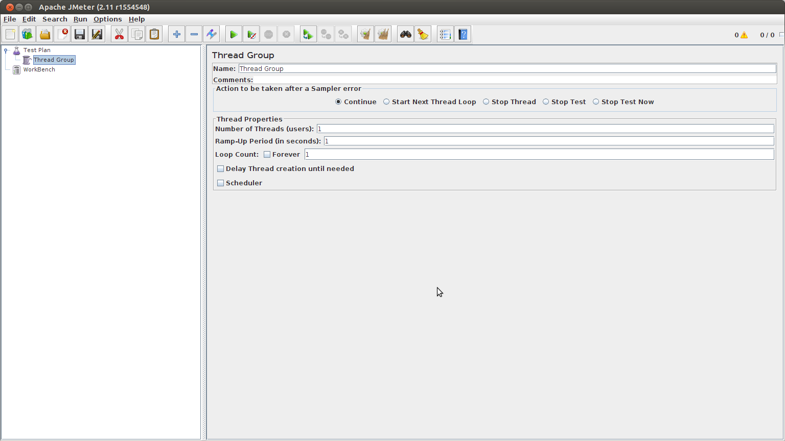
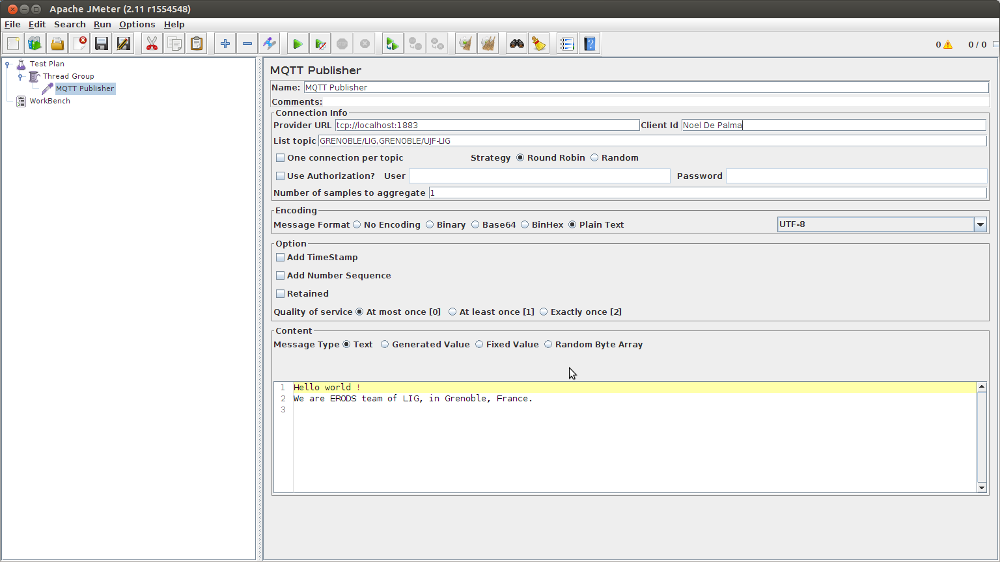
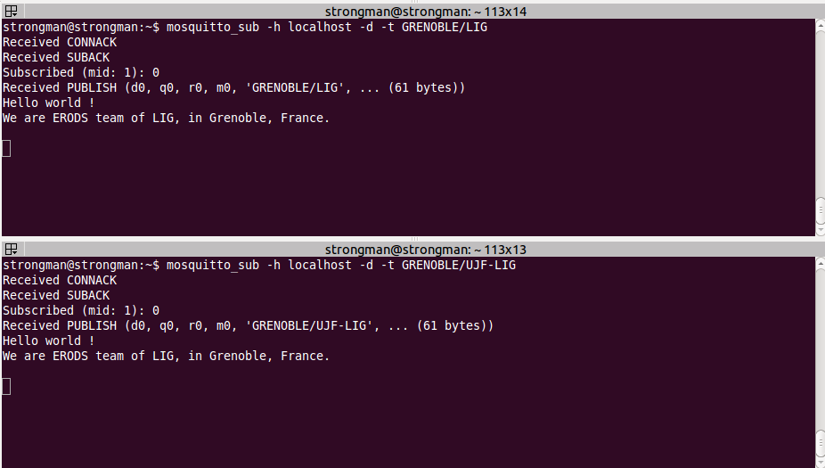
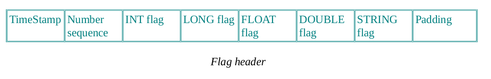
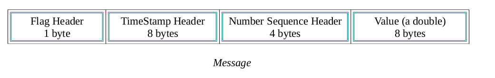
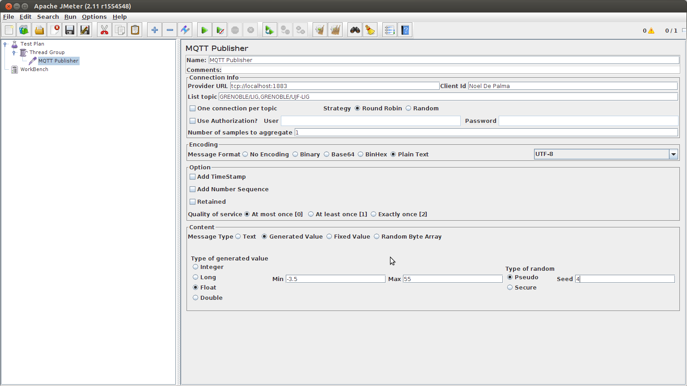
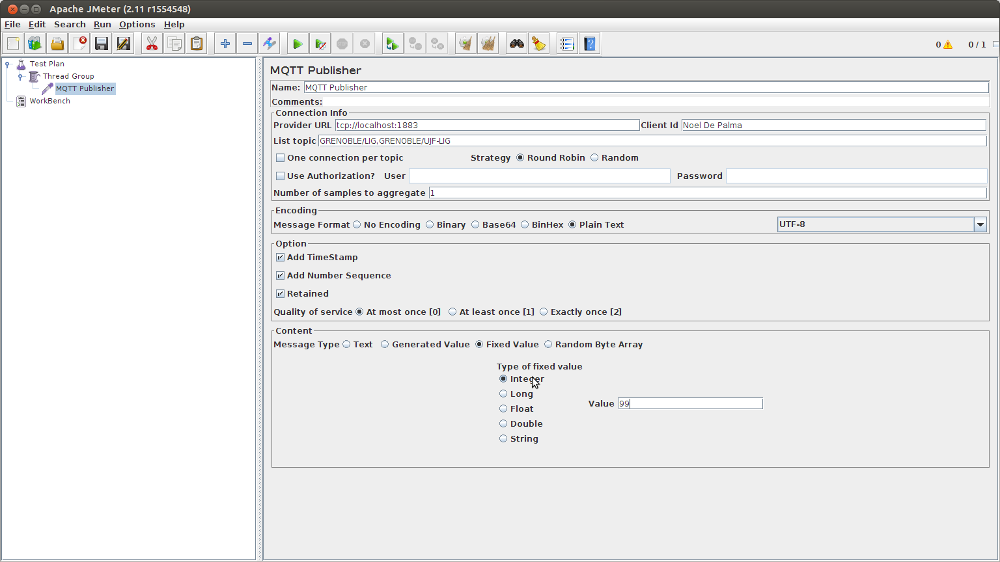
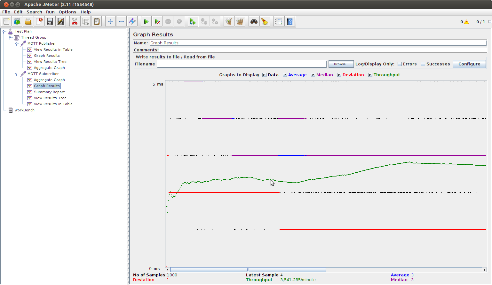
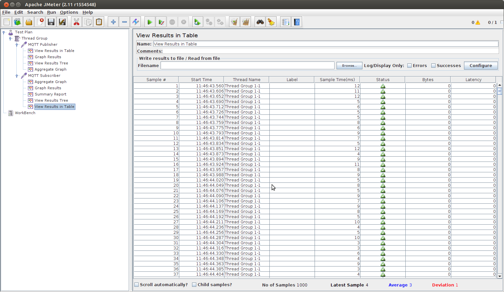

mqtt-jmeter
===========

This is the plugin for Jmeter to Test MQTT protocol

Tuan Hiep
ERODS Team
LIG- Grenoble-France

# Introduction

The MQTT Plugin in Jmeter is used for the injection testing of MQTT server. It permits the complete
test correspond many scenarios, which depend on type of messages, type of connections. Thanks to it's
interface graphic, the fact of testing mqtt protocol is taken easily.

# How to install MQTT plugin in Jmeter

From the repository: https://github.com/tuanhiep/mqtt-jmeter  
Get the source code, go to mqtt-jemeter folder and and use the command maven in terminal (Ubuntu):

	mvn clean install package

to obtain the file **mqtt-jmeter.jar** in **mqtt-jemeter/target**.  
Put the **mqtt-jemeter.jar** in the folder **lib/ext** of Jmeter
(to be downloaded on http://jmeter.apache.org/download_jmeter.cgi ).

Remind that, it's necessary to update the file **ApacheJMeter_core.jar** in the repository lib/ext of Jmeter.
Update the file messages.properties in the folder :/org/apache/jmeter/resources/
in **ApacheJMeter_core.jar** by new file messages.properties from
https://github.com/tuanhiep/mqtt-jmeter/tree/master/ressource

#  How to use MQTT plugin in Jmeter

##  MQTT Publisher

The interface graphic of Jmeter:

Right-click “Thread” and choose : Add → Sampler → MQTT Publisher

In the principal interface of MQTT Publisher we have the fields:

*Name:* Name of the MQTT Publisher  
*Comments:* Your comments  
*Provider URL:* the address of MQTT server example: tcp://localhost:1883  
*Client Id:* Your Id in the session with MQTT server example: Noel De Palma  
*List Topic:* The list of topic's name you want to publish  
 The topic'name is separated by a comma ","  
 For example: List Topic: GRENOBLE/LIG,GRENOBLE/Joseph Fourrier University  
 This means, you'll publish to 2 topic: GRENOBLE/LIG and GRENOBLE/Joseph Fourrier University
*Use Authorization check box:* Necessary in the case the connection needs the username and
password  
*User:* Your username  
*Password:* Your password  
*Number of samples to aggregate:* In other way, the number of messages you want to publish to
the MQTT sever in this MQTT Publisher thread, with the value like the configuration below.  
*Message Type:* You can choose : Text, Generated Value, Fixed Value (more detail below)  

  

*Add TimeStamp check box:* Add the timestamps to the message. The timestamps is 8 bytes  
*Add Number Sequence check box:* Add the number sequence to the message. Example: if you
publish 100 messages in your session, the message is numbered from 0 to 99. The number sequence 
field in the message is 4 bytes.  
*Retained check box:* You publish the messages as retained messages or not. The retain flag for an
MQTT message is set to false by default. This means that a broker will not hold onto the message 
so that any subscribers arriving after the message was sent will not see the message. By setting 
the retain flag, the message is held onto by the broker, so when the late arrivers connect to the 
broker or clients create a new subscription they get all the relevant retained messages”  
*Quality of service:* Three levels:  
0 : At most once  
1 : At least once  
2 : Exactly once  
Each message in MQTT can have its quality of service and retain flag set. The quality of service
advises the code if and how it should ensure the message arrives. There are three options, 0 (At Most Once),
1 (At Least Once) and 2 (Exactly Once). By default, a new message instance is set to "At Least Once",a Quality 
of Service (QoS) of 1, which means the sender will deliver the message at least once and, if there's no acknowledgement
 of it, it will keep sending it with a duplicate flag set until an acknowledgement turns up, at which point the
client removes the message from its persisted set of messages.  
A QoS of 0, "At Most Once", is the fastest mode, where the client doesn't wait for an
acknowledgement. This means, of course, that if there’s a disconnection or server failure, a message
may be lost. At the other end of the scale is a QoS of 2, "Exactly Once", which uses two pairs of
exchanges, first to transfer the message and then to ensure only one copy has been received and is
being processed. This does make Exactly Once the slower but most reliable QoS setting.

With MQTT Publisher in Jmeter, three type of messages can be sent (Message Type):  
*Text:* The text message, without flag header and the server MQTT can deliver it like a normal
text.  

  
 
  

1 byte “flag header” for the messages of type: Generated value, Fixed value  

  
In the flag header, if one field is set to 1, it means, we use the header in the message.
For example: With this flag header  

  
It means that, in the message, we have :  
  

*Generated Value:*  
The generated value can be of type: Integer, Long, Float, Double within the range [Min,Max] .
The type of random can be: Pseudo random or Secure random. In the two cases, we can set the Seed
for the generator.  

  
  
*Fixed Value:*  
The fixed value can be of type: Integer, Long, Float, Double, String within the range [Min,Max].  
  
  

For mesuring, thanks to Jmeter, we can add some listeners:  
  
  

## MQTT Subscriber  
 
 
  
 
 
 
*Name:* Name of the MQTT Subscriber  
*Comments:* Your comments  
*Provider URL:* The address of MQTT server  
*Client Id:* Your Id in the session  
*Topic:* The topic you want to subscribe.  
*Use Authorization :* Necessary in the case the connection need username and password  
*User:* your username  
*Password:* your password  
*Number of samples to aggregate:* In other way, the number of message you want to receive from
the topic in one session  
*Time out (milliseconds):* Timeout for the connection to receive message from the topic  

  
 
 
  
  
  
  
  Grenoble, France 14/03/2014,
  
  ERODS Team
  
  http://www.liglab.fr/erods?lang=fr&var_mode=calcul 
  
    
